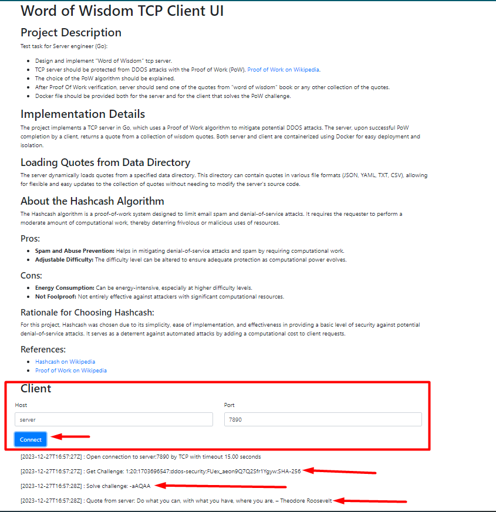

# Word of Wisdom TCP Server

## Project Overview
This project involves the implementation of a "Word of Wisdom" TCP server, designed as a test task for Server Engineers skilled in Go. The server is fortified against DDOS attacks using a Proof of Work (PoW) mechanism and responds with wisdom quotes upon successful validation.


Test link: http://45.153.185.127:7891/

## Features
- **Proof of Work**: Implements a challenge-response protocol to protect against DDOS attacks. More details about PoW can be found on [Wikipedia](https://en.wikipedia.org/wiki/Proof_of_work).
- **Quote Sharing**: Upon successful PoW completion, the server shares a quote from a curated collection of wisdom quotes.
- **Containerization**: Both the server and client are containerized using Docker, ensuring ease of deployment and environment consistency.

## How It Works
1. **Server Setup**: The server listens for incoming TCP connections and issues a PoW challenge to the client.
2. **Client Response**: The client solves the PoW challenge and sends the solution back to the server.
3. **Verification and Response**: After verifying the PoW solution, the server responds with a wisdom quote.

## Docker Setup
Docker files are provided for both the server and the client. This ensures that the applications can be easily deployed in Docker containers, which simplifies the setup and provides environment consistency.

## Running the Project
Use docker compose for building docker images and running
```shell
docker-compose down
docker-compose up
```
After running open http://127.0.0.1:7891 on web browser and test client.
You can also add custom quotes via (txt,json,yaml,csv) files attach files directory as a volume in docker on running server.

If you want to run just server use:
```shell
docker build -f server/Dockerfile -t ddos-security-server .
docker run -p 7890:7890 -v /path/to/your/quotes:/data -e DIFFICULTY=20 -e TIMEOUT=15s -e PORT=7890 ddos-security-server
```
